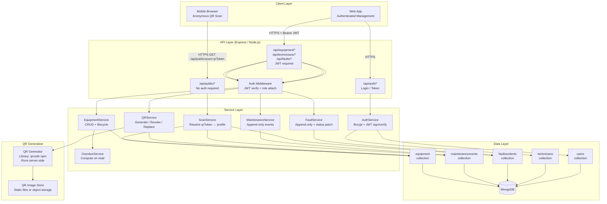

# QR Equipment Service — Architecture Package
**Vision71 Sprint | Architecture Workstream**
*Produced for parallel consumption by Dataset+QR and Frontend workstreams. No prior briefing required.*

---

## Flagged Renames / Baseline Deviations

None. All core entity names and endpoint paths are preserved exactly as specified. Fields added beyond the baseline are documented inline in Section 2 with a **[ADDED]** marker and a rationale note.

---

## 1. Architecture Diagram

### 1.1 Component Diagram (Mermaid)



---

### 1.2 Sequence: Public Scan-to-Profile Request Path

```
Mobile Browser                    Express (Public Router)    ScanService          MongoDB
     |                                    |                       |                   |
     |-- GET /api/public/scan/:qrToken -->|                       |                   |
     |                                    |-- validate token fmt ->|                   |
     |                                    |                       |-- find equipment  |
     |                                    |                       |   where qrToken=? |
     |                                    |                       |<-- doc or null ---|
     |                                    |                    [if not found]         |
     |                                    |<-- 404 {code:"QR_NOT_FOUND"} ------------|
     |                                    |                    [if qrStatus=revoked]  |
     |                                    |                       |-- find successor  |
     |                                    |<-- 200 {status:"revoked", successor?} ----|
     |                                    |                    [if active]            |
     |                                    |                       |-- fetch last 5    |
     |                                    |                       |   maintenance evts|
     |                                    |                       |-- fetch open faults|
     |                                    |                       |-- compute overdue |
     |                                    |<-- 200 PublicProfile ----------------------|
     |<--- JSON PublicProfile response ---|                       |                   |
```

Key notes:
- `id` and `assignedTechnicianId` are **never** included in the public response.
- `qrToken` is also **never** echoed back — the response contains only derived/safe fields.
- Maintenance history is summarized (count + last date + next date), not full records.
- Fault history is summarized (open count + severity summary), not full records with resolution notes.

---

### 1.3 Sequence: Authenticated Admin Write Path (e.g. POST maintenance event)

```
Web App (Admin/Technician)         Express (Private Router)   Auth Middleware    MaintenanceService   MongoDB
     |                                      |                        |                  |                |
     |-- POST /api/equipment/:id/maintenance|                        |                  |                |
     |   Authorization: Bearer <jwt>        |                        |                  |                |
     |                                      |-- extract Bearer token->|                 |                |
     |                                      |                        |-- verify JWT     |                |
     |                                      |                        |-- attach req.user|                |
     |                                      |                        |-- role check:    |                |
     |                                      |                        |   Admin|Tech only|                |
     |                                      |                     [403 if Viewer/anon] |                |
     |                                      |<-- req.user attached --|                  |                |
     |                                      |-- validate body ------>|                  |                |
     |                                      |   (Joi/Zod schema)     |                  |                |
     |                                      |-- call service --------|----------------->|                |
     |                                      |                        |                  |-- verify equip |
     |                                      |                        |                  |   exists + not |
     |                                      |                        |                  |   retired      |
     |                                      |                        |                  |-- insert record|
     |                                      |                        |                  |-- update equip |
     |                                      |                        |                  |   nextMaintDate|
     |                                      |<------- 201 MaintenanceEvent -------------|                |
     |<-- 201 response -------------------- |                        |                  |                |
```

---

## 2. Data Model

### 2.1 Design Note: `qrToken` vs `id`

`id` (MongoDB ObjectId) is sequential and enumerable — a 24-character hex string with embedded timestamp. Encoding `id` in a QR code would allow anyone with a QR to enumerate all equipment by incrementing the ObjectId. It would also permanently bind the physical QR label to the database record, making token rotation impossible without reprinting.

`qrToken` is a cryptographically random 32-byte value (64 hex chars, generated via `crypto.randomBytes(32).toString('hex')`). It has no relationship to `id`, has no timestamp component, cannot be guessed or enumerated, and can be regenerated (old token revoked, new token issued) without changing the underlying equipment record. The physical QR label is the only thing that changes.

---

### 2.2 Equipment Collection (`equipment`)

```
Field                     Type              Required   Notes
─────────────────────────────────────────────────────────────────────────────────────────
_id                       ObjectId          auto       Internal only. Never returned in API.
qrToken                   String            yes        crypto.randomBytes(32).hex. Unique index.
equipmentCode             String            yes        Human asset tag. Unique per tenant [A1].
name                      String            yes
category                  String (enum)     yes        Pump | Generator | Compressor |
                                                       HVAC | Electrical | Other
manufacturer              String            yes
model                     String            yes
serialNumber              String            no         Nullable; some equipment has none.
installationDate          Date              yes
location                  Object            yes        { site: String, building: String,
                                                         zone: String }
status                    String (enum)     yes        Operational | Under Maintenance |
                                                         Faulty | Retired
assignedTechnicianId      ObjectId          no         Ref: technicians._id. Nullable.
maintenanceIntervalDays   Number (int)      yes        Positive integer.
nextMaintenanceDate       Date              no         Nullable until first maintenance logged.
qrStatus                  String (enum)     yes        active | revoked | replaced
                                                       Default: active on creation.
replacedByEquipmentId     ObjectId          no         Ref: equipment._id. Set on retire+replace.
replacedFromEquipmentId   ObjectId          no         Ref: equipment._id. Set on new record.
isPublicVisible           Boolean           yes        Default: true.
─────────────────────────────────────────────────────────────────────────────────────────
[ADDED] tenantId          ObjectId          yes        Ref: tenants._id [A1]. Prevents cross-
                                                       tenant data leakage. Indexed.
[ADDED] qrTokenHistory    Array<Object>     yes        Default: []. Each entry:
                                                       { token: String, revokedAt: Date,
                                                         revokedBy: ObjectId (userId),
                                                         reason: String }
                                                       Audit trail of all previous tokens.
[ADDED] notes             String            no         Internal free-text, not public-visible.
createdAt                 Date              auto       Set on insert, immutable.
updatedAt                 Date              auto       Updated by Mongoose timestamps.
```

**Indexes:**
```
{ qrToken: 1 }           — unique, sparse: false  (primary lookup for scan)
{ equipmentCode: 1, tenantId: 1 } — unique compound  (asset tag unique per tenant)
{ tenantId: 1, status: 1 }        — compound (list + filter queries)
{ tenantId: 1, nextMaintenanceDate: 1 } — compound (overdue dashboard)
{ assignedTechnicianId: 1 }       — single (technician workload queries)
```

---

### 2.3 MaintenanceEvent Collection (`maintenanceevents`)

```
Field                     Type              Required   Notes
─────────────────────────────────────────────────────────────────────────────────────────
_id                       ObjectId          auto
equipmentId               ObjectId          yes        Ref: equipment._id. Indexed.
type                      String (enum)     yes        Scheduled | Preventive |
                                                         Corrective | Inspection
performedByTechnicianId   ObjectId          yes        Ref: technicians._id.
date                      Date              yes        Date work was performed.
description               String            yes
partsUsed                 Array<String>     no         Default: [].
nextRecommendedDate       Date              no         Technician's recommendation.
attachments               Array<Object>     no         Default: []. Each:
                                                       { filename: String, url: String,
                                                         uploadedAt: Date }
createdBy                 ObjectId          yes        Ref: users._id.
createdAt                 Date              auto       Immutable. Set on insert.
─────────────────────────────────────────────────────────────────────────────────────────
[ADDED] tenantId          ObjectId          yes        Denormalized from equipment for
                                                       efficient tenant-scoped queries.
```

**Immutability rule:** No `UPDATE` or `DELETE` operations on this collection. Corrections are new records. The API layer enforces this — there is no `PATCH /api/equipment/:id/maintenance/:eventId` endpoint.

**Indexes:**
```
{ equipmentId: 1, date: -1 }   — compound (history list, most recent first)
{ tenantId: 1, date: -1 }      — tenant-wide audit queries
```

---

### 2.4 FaultIncident Collection (`faultincidents`)

```
Field                     Type              Required   Notes
─────────────────────────────────────────────────────────────────────────────────────────
_id                       ObjectId          auto
equipmentId               ObjectId          yes        Ref: equipment._id. Indexed.
reportedDate              Date              yes
reportedBy                ObjectId          yes        Ref: users._id. (Authenticated only)
                                                       [ADDED: see note below]
severity                  String (enum)     yes        Low | Medium | High | Critical
description               String            yes
status                    String (enum)     yes        Open | In Progress | Resolved
                                                       Default: Open.
resolvedDate              Date              no         Nullable until status=Resolved.
resolutionNotes           String            no         Nullable. Not public-visible.
linkedMaintenanceEventId  ObjectId          no         Ref: maintenanceevents._id.
createdAt                 Date              auto       Immutable.
─────────────────────────────────────────────────────────────────────────────────────────
[ADDED] tenantId          ObjectId          yes        Denormalized from equipment.
[ADDED] resolvedBy        ObjectId          no         Ref: users._id. Set on resolution.
[ADDED] statusHistory     Array<Object>     yes        Default: []. Audit trail of status
                                                       changes: { from, to, changedBy,
                                                         changedAt, note }
```

**Note on `reportedBy`:** The baseline listed this field without specifying its type. Decision: it is always a `users._id` reference (authenticated users only can create fault records). Public scan users cannot create faults — this is a deliberate security boundary.

**Immutability rule:** The record body is immutable after creation. Only `status`, `resolvedDate`, `resolutionNotes`, `resolvedBy`, `linkedMaintenanceEventId`, and `statusHistory` are patchable via `PATCH /api/faults/:id/resolve`. The `PATCH` is append-to-audit, not free-edit.

**Indexes:**
```
{ equipmentId: 1, reportedDate: -1 }  — history list
{ equipmentId: 1, status: 1 }         — open fault count
{ tenantId: 1, status: 1, severity: 1 } — management dashboard
```

---

### 2.5 Technician Collection (`technicians`)

```
Field                     Type              Required   Notes
─────────────────────────────────────────────────────────────────────────────────────────
_id                       ObjectId          auto
name                      String            yes
specialty                 String            yes        e.g. "Hydraulics", "Electrical"
contactInfo               Object            yes        { phone: String, email: String }
                                                       Private — not in public responses.
status                    String (enum)     yes        active | inactive
─────────────────────────────────────────────────────────────────────────────────────────
[ADDED] tenantId          ObjectId          yes
```

**Indexes:**
```
{ tenantId: 1, status: 1 }
```

---

### 2.6 User Collection (`users`)

```
Field                     Type              Required   Notes
─────────────────────────────────────────────────────────────────────────────────────────
_id                       ObjectId          auto
name                      String            yes
email                     String            yes        Unique per tenant.
passwordHash              String            yes        bcrypt, 12 rounds minimum.
role                      String (enum)     yes        Admin | Technician | Viewer
linkedTechnicianId        ObjectId          no         Ref: technicians._id. Nullable.
                                                       Set when role=Technician.
─────────────────────────────────────────────────────────────────────────────────────────
[ADDED] tenantId          ObjectId          yes
[ADDED] isActive          Boolean           yes        Default: true. Soft-disable accounts.
[ADDED] lastLoginAt       Date              no         Updated on successful login.
[ADDED] passwordChangedAt Date              no         Used to invalidate tokens issued
                                                       before a password reset.
createdAt                 Date              auto
updatedAt                 Date              auto
```

**Indexes:**
```
{ email: 1, tenantId: 1 }  — unique compound (login lookup)
{ tenantId: 1, role: 1 }
```

---

### 2.7 Tenant Collection (`tenants`) [ADDED]

The baseline did not include a Tenant entity. Added because the requirement explicitly states "do not hard-code a single client/company." Every other collection has a `tenantId` foreign key.

```
Field                     Type              Required   Notes
─────────────────────────────────────────────────────────────────────────────────────────
_id                       ObjectId          auto
name                      String            yes        e.g. "Acme Industrial"
slug                      String            yes        URL-safe identifier. Unique.
isActive                  Boolean           yes        Default: true.
createdAt                 Date              auto
```

**Indexes:**
```
{ slug: 1 }  — unique
```

---

## 3. Access Matrix

Legend: **A** = Allowed | **D** = Denied | **A*** = Allowed with field restrictions

Roles: **Public** (anonymous QR scan) | **Viewer** (authenticated read-only) | **Technician** (authenticated, operational write) | **Admin** (full access)

| Action / Resource | Public | Viewer | Technician | Admin |
|---|---|---|---|---|
| **View equipment profile (public fields)** | **A*** | A | A | A |
| **View equipment profile (all fields incl. notes, assignedTechnicianId)** | D | A | A | A |
| **View maintenance history (summary: count, last date, next date)** | **A*** | A | A | A |
| **View maintenance history (full records incl. parts, attachments)** | D | A | A | A |
| **View fault history (summary: open count, highest severity)** | **A*** | A | A | A |
| **View fault history (full records incl. resolutionNotes, reportedBy)** | D | A | A | A |
| **View technician name and specialty** | D | A | A | A |
| **View technician contact info (phone, email)** | D | D | **A*** (own record only) | A |
| **Add maintenance event** | D | D | A | A |
| **Edit maintenance event** | D | D | D | D (nobody — immutable) |
| **Delete maintenance event** | D | D | D | D (nobody — immutable) |
| **Add fault incident** | D | D | A | A |
| **Resolve fault (PATCH status/notes)** | D | D | A | A |
| **Edit fault core fields after creation** | D | D | D | D (nobody — immutable) |
| **Edit equipment (name, location, status, interval, etc.)** | D | D | D | A |
| **Retire equipment** | D | D | D | A |
| **Replace equipment (link old → new)** | D | D | D | A |
| **Regenerate QR token** | D | D | D | A |
| **Revoke QR token** | D | D | D | A |
| **View overdue dashboard** | D | A | A | A |
| **Create equipment** | D | D | D | A |
| **Manage users** | D | D | D | A |
| **View own assigned equipment list** | D | D | A (own only) | A |

### Field Restrictions for Public Role (A*)

**Equipment profile** — returned fields:
- `equipmentCode`, `name`, `category`, `manufacturer`, `model`
- `installationDate`, `location`
- `status`, `nextMaintenanceDate`
- `isOverdue` (computed boolean), `daysOverdue` (computed int, 0 if not overdue)

**Excluded from public**: `_id`, `qrToken`, `qrTokenHistory`, `assignedTechnicianId`, `serialNumber`, `maintenanceIntervalDays`, `notes`, `tenantId`, `qrStatus`, `replacedByEquipmentId`, `replacedFromEquipmentId`

**Maintenance history** — returned for public:
- `{ totalCount: Number, lastMaintenanceDate: Date|null, nextMaintenanceDate: Date|null, lastMaintenanceType: String|null }`

**Fault history** — returned for public:
- `{ openCount: Number, highestOpenSeverity: String|null }`

**Technician** — nothing returned for public. The assigned technician's name is intentionally withheld because it constitutes PII in an industrial context and has no actionable value for an anonymous scanner.

---

## 4. QR Lifecycle Rules

### 4.1 QR Issuance on Equipment Creation

1. On `POST /api/equipment`, after the equipment document is validated and before it is persisted, `QRService.generateToken()` is called.
2. `generateToken()` calls `crypto.randomBytes(32).toString('hex')` and checks uniqueness against the `equipment` collection (collision is astronomically unlikely but must be handled with a retry loop, max 3 attempts).
3. The equipment is persisted with `qrToken = <generated>` and `qrStatus = 'active'`.
4. The QR code image (encoding the URL `https://<domain>/scan/<qrToken>`) is generated server-side using the `qrcode` npm library and stored. The storage URL is returned in the `POST /api/equipment` response as `qrCodeUrl` so the label-printing workstream can fetch it immediately.
5. `qrTokenHistory` is initialized to `[]`.

### 4.2 Regenerate QR (`POST /api/equipment/:id/qr/regenerate`)

Trigger: Admin only. Use cases: QR label physically damaged/lost, suspected token exposure.

Steps:
1. Load equipment. If not found or retired, return 404/409 respectively.
2. Push the current token to `qrTokenHistory`: `{ token: currentToken, revokedAt: now, revokedBy: req.user._id, reason: req.body.reason }`.
3. Generate a new token via `generateToken()`.
4. Set `qrToken = newToken`, `qrStatus = 'active'`.
5. Generate and store new QR image. Return `qrCodeUrl`.
6. Old token is now invalid — any scan of it will hit the `QR_NOT_FOUND` path (token not in `qrToken` field of any document, and history entries are not scanned-against).

**Revoke semantics:** "Revoked" means the token string is moved out of the active `qrToken` field into `qrTokenHistory`. The equipment record is retained in full. There is no deletion. The revoke reason and actor are preserved. The equipment's `qrStatus` transitions to `revoked` only if it is being retired without a replacement (see 4.4). If regenerating, `qrStatus` stays `active` on the new token.

### 4.3 Scan of a Revoked or Retired Token

A scan arrives at `GET /api/public/scan/:qrToken`. The lookup queries `{ qrToken: <value>, qrStatus: 'active' }`.

**Case A — Token not found at all (never existed, or was rotated out of active field):**
Response: `404 { code: "QR_NOT_FOUND", message: "This QR code is not recognized." }`

**Case B — Token found but `qrStatus = 'revoked'` (retired equipment, no successor):**
Response:
```json
HTTP 200
{
  "status": "retired",
  "code": "QR_RETIRED",
  "message": "This equipment has been retired and is no longer in service.",
  "retiredEquipmentCode": "PUMP-014",
  "retiredEquipmentName": "Primary Transfer Pump",
  "successor": null
}
```

**Case C — Token found but `qrStatus = 'replaced'` (equipment replaced by newer unit):**
Response:
```json
HTTP 200
{
  "status": "replaced",
  "code": "QR_REPLACED",
  "message": "This equipment has been replaced. Scan the new unit's QR code, or view its profile below.",
  "retiredEquipmentCode": "PUMP-014",
  "successor": {
    "equipmentCode": "PUMP-015",
    "name": "Primary Transfer Pump Mk2",
    "qrCodeUrl": "https://<domain>/scan/<newQrToken>"
  }
}
```

Note: The successor's `qrToken` value is **not** returned. Only the URL path (which contains it) is returned, and only because the QR URL is already public knowledge once the new QR label exists. The decision to include this URL here is justified because withholding it would make the replaced-equipment flow useless to a scanner.

**Why 200 not 404 for revoked/replaced?** A 404 implies the resource never existed. For retired/replaced equipment, the resource existed — its status is meaningful information. Returning 200 with a structured status field allows the frontend to render a proper informational screen rather than a generic error page.

### 4.4 Replace Equipment (`POST /api/equipment/:id/replace`)

Admin only. This is a two-record operation:

1. Validate that the old equipment (`id`) exists and is not already replaced/retired.
2. Validate the request body contains a new equipment definition.
3. Create the new equipment record (full creation flow including new `qrToken` generation, `qrStatus = 'active'`, `replacedFromEquipmentId = oldEquipment._id`).
4. Update the old equipment: `status = 'Retired'`, `qrStatus = 'replaced'`, `replacedByEquipmentId = newEquipment._id`.
5. Both operations are executed. If the new equipment insert fails, the old record is not modified (validate before persist). MongoDB does not offer ACID transactions across documents in the same way a RDBMS does, but since we insert new first and update old second, a failure on step 4 leaves an orphaned new record — which is acceptable (no data loss, can be cleaned up manually). **[A2]**

### 4.5 Retire Equipment (`POST /api/equipment/:id/retire`)

Admin only. No successor.

1. Set `status = 'Retired'`, `qrStatus = 'revoked'`.
2. Push current `qrToken` to `qrTokenHistory` with `reason: 'retired'`.
3. Set `qrToken` to a placeholder sentinel value that will never match a scan (e.g. `null` or a deterministic non-random string) so the unique index is not violated and the scan path clearly reaches **Case B** above.

**Decision:** Set `qrToken` to `null` and make the unique index sparse (`sparse: true`). Null values are excluded from sparse unique indexes. This cleanly handles multiple retired records without index conflicts.

### 4.6 Who Can Trigger Each QR Action

| Action | Role Required |
|---|---|
| Generate QR on creation | Admin (equipment creation) |
| Regenerate QR | Admin |
| Revoke QR (via retire) | Admin |
| Replace equipment (marks old as replaced) | Admin |
| Scan (public read) | Anyone (no auth) |

---

## 5. API Contract

### 5.1 Overdue Logic

**Definition:** Equipment is overdue if `nextMaintenanceDate` is not null and `nextMaintenanceDate < today (UTC midnight)`.

**Computation:** On-the-fly at read time, not precomputed/stored.

**Justification:** Precomputing requires either a scheduled job (operational complexity, drift risk if the job fails) or a database trigger (not idiomatic in MongoDB/Express). Since overdue status changes exactly once per day per item, and the computation is a single date comparison, the per-read cost is negligible. Storing it would create a stale-data risk (a record fetched milliseconds before midnight could show stale overdue status). On-the-fly is simpler and always correct.

**Fields added to responses:**
```
isOverdue: Boolean   — true if nextMaintenanceDate != null && nextMaintenanceDate < Date.now()
daysOverdue: Number  — Math.floor((Date.now() - nextMaintenanceDate) / 86400000), min 0
                       0 if not overdue (not negative)
```

These fields appear in:
- `GET /api/public/scan/:qrToken` (public profile)
- `GET /api/equipment/:id` (authenticated)
- `GET /api/equipment` (authenticated list, on each item)
- `GET /api/equipment/overdue` (all items will have `isOverdue: true`)

---

### 5.2 Common Response Envelope

All API responses use this shape:

**Success:**
```json
{
  "success": true,
  "data": <payload>
}
```

**Error:**
```json
{
  "success": false,
  "error": {
    "code": "MACHINE_READABLE_CODE",
    "message": "Human readable description",
    "details": <optional validation errors array>
  }
}
```

**Pagination** (list endpoints):
```json
{
  "success": true,
  "data": [...],
  "pagination": {
    "page": 1,
    "pageSize": 20,
    "totalCount": 143,
    "totalPages": 8
  }
}
```

Query params for pagination: `?page=1&pageSize=20` (defaults: page=1, pageSize=20, max pageSize=100).

---

### 5.3 Authentication

**POST /api/auth/login**

- Auth required: No
- Request body:
```json
{
  "email": "string (required)",
  "password": "string (required)"
}
```
- Response 200:
```json
{
  "success": true,
  "data": {
    "token": "JWT string",
    "expiresIn": 86400,
    "user": {
      "id": "string",
      "name": "string",
      "email": "string",
      "role": "Admin|Technician|Viewer"
    }
  }
}
```
- JWT payload: `{ sub: userId, role, tenantId, iat, exp }`. Expiry: 24 hours. **[A3]**
- Errors:
  - `401 INVALID_CREDENTIALS` — email not found or password mismatch (same message for both — do not leak which field failed)
  - `403 ACCOUNT_DISABLED` — `isActive = false`
  - `422 VALIDATION_ERROR` — missing/malformed fields

---

### 5.4 Public Endpoints (No Auth)

**GET /api/public/scan/:qrToken**

- Auth required: No
- Path params: `qrToken` (string, 64 hex chars — validate format, return 422 if malformed)
- Response 200 (active equipment, `isPublicVisible: true`):
```json
{
  "success": true,
  "data": {
    "equipmentCode": "PUMP-014",
    "name": "Primary Transfer Pump",
    "category": "Pump",
    "manufacturer": "Grundfos",
    "model": "CM5-6 A-R-I-E-AVBE",
    "installationDate": "2021-03-15T00:00:00.000Z",
    "location": { "site": "Plant A", "building": "Block 3", "zone": "Zone 2" },
    "status": "Operational",
    "nextMaintenanceDate": "2026-09-15T00:00:00.000Z",
    "isOverdue": false,
    "daysOverdue": 0,
    "maintenanceSummary": {
      "totalCount": 12,
      "lastMaintenanceDate": "2026-03-10T00:00:00.000Z",
      "lastMaintenanceType": "Scheduled"
    },
    "faultSummary": {
      "openCount": 1,
      "highestOpenSeverity": "Medium"
    }
  }
}
```
- Response 200 (revoked/replaced — see Section 4.3 for full shapes)
- Response 200 (`isPublicVisible: false`):
```json
{
  "success": true,
  "data": {
    "status": "restricted",
    "code": "QR_NOT_PUBLIC",
    "message": "This equipment profile is not publicly accessible."
  }
}
```
- Errors:
  - `422 VALIDATION_ERROR` — token format invalid (not 64 hex chars)
  - `404 QR_NOT_FOUND` — token not found in any active record

**Rate limit:** 60 requests/minute per IP on this endpoint (protect against token brute-forcing). **[A4]**

---

### 5.5 Equipment Endpoints (Auth Required)

All endpoints below require `Authorization: Bearer <jwt>`. The middleware attaches `req.user = { id, role, tenantId }`. All queries are automatically scoped to `tenantId`.

---

**GET /api/equipment**

- Role: Admin | Technician | Viewer
- Query params:
  - `status` (enum filter, optional)
  - `category` (string filter, optional)
  - `assignedTechnicianId` (ObjectId filter, optional; Technician role: only own id allowed)
  - `page`, `pageSize`
- Response 200: paginated list of equipment objects (all fields except `_id`, `qrToken`, `qrTokenHistory`)
- Each item includes `isOverdue`, `daysOverdue`
- Errors:
  - `401 UNAUTHORIZED` — no/invalid token
  - `403 FORBIDDEN` — role not allowed (not applicable here — all roles allowed)

---

**GET /api/equipment/overdue**

- Role: Admin | Technician | Viewer
- Note: This route must be registered **before** `GET /api/equipment/:id` to prevent Express interpreting `overdue` as an `:id` value.
- Query params: `page`, `pageSize`
- Logic: `{ tenantId, nextMaintenanceDate: { $lt: new Date() }, nextMaintenanceDate: { $ne: null }, status: { $ne: 'Retired' } }`
- Response 200: paginated list, same shape as `GET /api/equipment` items, all with `isOverdue: true`
- Each item includes `daysOverdue` (will be > 0)

---

**GET /api/equipment/:id**

- Role: Admin | Technician | Viewer
- Path params: `id` (MongoDB ObjectId string — validate format)
- Response 200: full equipment object (all fields except `_id`, `qrToken`, `qrTokenHistory`) + `isOverdue`, `daysOverdue`
- Errors:
  - `401` — no/invalid token
  - `403` — tenant mismatch (equipment exists but belongs to different tenant)
  - `404 EQUIPMENT_NOT_FOUND` — id not found or outside tenant

---

**POST /api/equipment**

- Role: Admin only
- Request body:
```json
{
  "equipmentCode": "string (required, unique per tenant)",
  "name": "string (required)",
  "category": "Pump|Generator|Compressor|HVAC|Electrical|Other (required)",
  "manufacturer": "string (required)",
  "model": "string (required)",
  "serialNumber": "string (optional)",
  "installationDate": "ISO8601 date (required)",
  "location": {
    "site": "string (required)",
    "building": "string (required)",
    "zone": "string (required)"
  },
  "maintenanceIntervalDays": "positive integer (required)",
  "assignedTechnicianId": "ObjectId string (optional)",
  "isPublicVisible": "boolean (optional, default: true)",
  "notes": "string (optional)"
}
```
- Response 201:
```json
{
  "success": true,
  "data": {
    "id": "string (public-safe alias for _id, returned as string)",
    "equipmentCode": "...",
    "qrCodeUrl": "https://<domain>/qr-images/<qrToken>.png",
    ...all other equipment fields except _id, qrToken, qrTokenHistory...
  }
}
```
- Errors:
  - `401` — no/invalid token
  - `403` — not Admin
  - `409 EQUIPMENT_CODE_CONFLICT` — `equipmentCode` already exists in tenant
  - `422 VALIDATION_ERROR` — missing required fields, invalid enum, invalid ObjectId format

---

**PATCH /api/equipment/:id**

- Role: Admin only
- Allowed patchable fields: `name`, `category`, `manufacturer`, `model`, `serialNumber`, `location`, `maintenanceIntervalDays`, `assignedTechnicianId`, `isPublicVisible`, `notes`
- Explicitly NOT patchable via this endpoint: `status` (use dedicated lifecycle endpoints), `qrToken`, `qrStatus`, `installationDate`, `createdAt`
- Response 200: updated equipment object (same shape as GET)
- Errors:
  - `401`, `403` — auth/role
  - `404` — not found
  - `409 EQUIPMENT_CODE_CONFLICT` — if `equipmentCode` patch attempted and conflicts
  - `422 VALIDATION_ERROR`

---

**POST /api/equipment/:id/retire**

- Role: Admin only
- Request body:
```json
{ "reason": "string (optional, stored in qrTokenHistory entry)" }
```
- Idempotency: if already `Retired`, return `409 ALREADY_RETIRED`
- Response 200: updated equipment object with `status: 'Retired'`, `qrStatus: 'revoked'`
- Errors: `401`, `403`, `404`, `409 ALREADY_RETIRED`

---

**POST /api/equipment/:id/replace**

- Role: Admin only
- Request body: full new equipment definition (same fields as `POST /api/equipment` body, excluding `equipmentCode` being optional — it must be provided for the new unit)
- Response 201:
```json
{
  "success": true,
  "data": {
    "retiredEquipment": { "id": "...", "equipmentCode": "PUMP-014", "status": "Retired" },
    "newEquipment": { "id": "...", "equipmentCode": "PUMP-015", "qrCodeUrl": "...", ...}
  }
}
```
- Errors:
  - `401`, `403`
  - `404` — old equipment not found
  - `409 ALREADY_REPLACED` — old equipment already has `replacedByEquipmentId` set
  - `409 EQUIPMENT_CODE_CONFLICT` — new equipment code already exists
  - `422 VALIDATION_ERROR`

---

**POST /api/equipment/:id/qr/regenerate**

- Role: Admin only
- Request body:
```json
{ "reason": "string (optional)" }
```
- Response 200:
```json
{
  "success": true,
  "data": {
    "qrCodeUrl": "https://<domain>/qr-images/<newToken>.png",
    "regeneratedAt": "ISO8601 timestamp"
  }
}
```
- Errors:
  - `401`, `403`
  - `404` — not found
  - `409 EQUIPMENT_RETIRED` — cannot regenerate for retired equipment

---

### 5.6 Maintenance Endpoints (Auth Required)

**GET /api/equipment/:id/maintenance**

- Role: Admin | Technician | Viewer
- Query params: `page`, `pageSize`, `type` (enum filter)
- Response 200: paginated list of MaintenanceEvent objects (all fields except `_id` → returned as `id`)
- Errors: `401`, `403`, `404 EQUIPMENT_NOT_FOUND`

---

**POST /api/equipment/:id/maintenance**

- Role: Admin | Technician
- Request body:
```json
{
  "type": "Scheduled|Preventive|Corrective|Inspection (required)",
  "performedByTechnicianId": "ObjectId (required)",
  "date": "ISO8601 date (required, cannot be future date)",
  "description": "string (required)",
  "partsUsed": ["string"] ,
  "nextRecommendedDate": "ISO8601 date (optional)",
  "attachments": [{ "filename": "string", "url": "string" }]
}
```
- Side effect: if `nextRecommendedDate` is provided, equipment's `nextMaintenanceDate` is updated to this value. If not provided, `nextMaintenanceDate` is recalculated as `date + maintenanceIntervalDays`. **[A5]**
- Response 201: created MaintenanceEvent object
- Errors:
  - `401`, `403`
  - `404 EQUIPMENT_NOT_FOUND`
  - `409 EQUIPMENT_RETIRED` — cannot add maintenance to retired equipment
  - `422 VALIDATION_ERROR` — future date, missing required fields

---

### 5.7 Fault Endpoints (Auth Required)

**GET /api/equipment/:id/faults**

- Role: Admin | Technician | Viewer
- Query params: `status` (Open|In Progress|Resolved), `severity`, `page`, `pageSize`
- Response 200: paginated list of FaultIncident objects
- Errors: `401`, `403`, `404 EQUIPMENT_NOT_FOUND`

---

**POST /api/equipment/:id/faults**

- Role: Admin | Technician
- Request body:
```json
{
  "reportedDate": "ISO8601 date (required)",
  "severity": "Low|Medium|High|Critical (required)",
  "description": "string (required)"
}
```
- Response 201: created FaultIncident with `status: 'Open'`
- Errors:
  - `401`, `403`
  - `404 EQUIPMENT_NOT_FOUND`
  - `409 EQUIPMENT_RETIRED`
  - `422 VALIDATION_ERROR`

---

**PATCH /api/faults/:id/resolve**

- Role: Admin | Technician
- This is a status-advance operation, not a free edit. The only allowed transitions are: `Open → In Progress`, `Open → Resolved`, `In Progress → Resolved`. No backward transitions.
- Request body:
```json
{
  "status": "In Progress|Resolved (required)",
  "resolutionNotes": "string (required if status=Resolved)",
  "resolvedDate": "ISO8601 date (required if status=Resolved)",
  "linkedMaintenanceEventId": "ObjectId (optional)"
}
```
- Side effect: appends to `statusHistory`.
- Response 200: updated FaultIncident
- Errors:
  - `401`, `403`
  - `404 FAULT_NOT_FOUND`
  - `409 INVALID_STATUS_TRANSITION` — e.g. trying to set Resolved → Open
  - `422 VALIDATION_ERROR` — missing resolutionNotes/resolvedDate when resolving

---

### 5.8 Technician Endpoints (Auth Required)

**GET /api/technicians**

- Role: Admin | Technician | Viewer
- Query params: `status` (active|inactive), `page`, `pageSize`
- Response: list of technician objects. Contact info (`contactInfo`) is excluded for Viewer and Technician roles (unless Technician is requesting their own linked record). Admin always receives full objects.

---

**GET /api/technicians/:id**

- Role: Admin | Technician | Viewer
- Contact info exclusion same rules as list above.
- Errors: `401`, `403`, `404 TECHNICIAN_NOT_FOUND`

---

## 6. Permission / Threat Notes

### 6.1 Threat: Equipment ID Enumeration

**Scenario:** An attacker sends `GET /api/equipment/:id` with sequential or brute-forced ObjectIds to extract the full equipment catalog.

**Mitigation:**
- All private equipment endpoints require a valid JWT. No token = 401 immediately.
- Even with a valid token, all queries are scoped to `tenantId` from the JWT payload. A cross-tenant ObjectId hit returns 404 (not 403), so the attacker cannot even confirm the record exists outside their tenant.
- The public scan endpoint uses `qrToken` (256-bit random), not `id`. There is no public endpoint that accepts `id` as input.
- Rate limiting on `GET /api/equipment/:id` and `GET /api/equipment/overdue` is handled at the API gateway level (recommended: 300 req/min per authenticated user). **[A4]**

### 6.2 Threat: Revoked QR Replay

**Scenario:** An attacker scans an old QR code (from a retired or replaced machine, or from a photograph of a previous label) to access a stale profile.

**Mitigation:**
- `GET /api/public/scan/:qrToken` queries `{ qrToken: <value>, qrStatus: 'active' }`. A revoked/replaced token is no longer in the `qrToken` field (moved to `qrTokenHistory` or set to null).
- The lookup therefore returns no document via the active index.
- The response for a token found in history (not applicable — history is not scanned-against) is a 404 or a tombstone 200. There is no leakage of current equipment data to a stale token holder.
- The former token cannot be used to access the new equipment's profile because the new record has a completely different, independently generated token.

### 6.3 Threat: Authenticated Endpoint Without Correct Role

**Scenario:** A Viewer-role JWT holder calls `POST /api/equipment` or `PATCH /api/faults/:id/resolve`.

**Mitigation:**
- The Auth Middleware runs first (JWT signature + expiry check). Then a Role Guard middleware checks `req.user.role` against the endpoint's required roles list before any service or DB call.
- Insufficient role returns `403 FORBIDDEN` with `{ code: "INSUFFICIENT_ROLE" }`. The response does not reveal what the required role is.
- A Technician calling `POST /api/equipment` (Admin-only) also gets 403.
- Middleware is applied at router mount level, not route-by-route, so it cannot be accidentally omitted from a new route added to an existing router.

### 6.4 Threat: Direct History Deletion or Edit

**Scenario:** An authenticated Admin or Technician calls a custom HTTP client with `DELETE /api/equipment/:id/maintenance/:eventId` or `PUT /api/equipment/:id/maintenance/:eventId` to alter audit history.

**Mitigation:**
- These routes are simply not registered. Express will return a 404 for any attempt. There is no `DELETE` or `PUT` handler on maintenance or fault endpoints.
- The database layer never issues `deleteOne`/`deleteMany`/`updateOne` on `maintenanceevents`. All service calls go through typed service functions that only execute `insertOne`. Code review policy (documented in Section 7, Assumption A6) prohibits adding delete/update operations to these collections.
- For faults, the only `updateOne` allowed is the status-advance operation in `FaultService.resolveIncident()`, which is constrained to the four patchable fields and validated against the state machine.

### 6.5 Threat: JWT Token Reuse After Password Change / Account Disable

**Scenario:** A user's account is disabled (`isActive: false`) or their password is changed, but they continue using an old JWT that hasn't expired.

**Mitigation:**
- The Auth Middleware performs a lightweight DB check on the user record for endpoints that perform write operations (POST/PATCH/DELETE routes). This check validates `isActive` and `passwordChangedAt <= iat` (token issued before password change). **[A3]**
- Read-only endpoints (GET) do not incur this DB hit to preserve performance.
- When `isActive` is set to false, the change takes effect on the next write attempt within the token's 24-hour window.

---

## 7. Assumptions

**A1 — Multi-tenancy model:** The requirement says "do not hard-code a single client/company." This was interpreted as requiring a multi-tenant data model from day one, implemented as a `tenantId` discriminator field on every collection (shared database, separate data). If the team intends single-tenant for this sprint's demo, the `tenantId` fields can be left in the schema as a constant and the middleware can inject a hardcoded sentinel value — no schema migration needed when multi-tenancy is enabled later. If multi-tenancy is truly out of scope, flag it and the `tenantId` fields can be made optional.

**A2 — No MongoDB transactions:** The replace-equipment operation writes two documents without a transaction (new insert + old update). MongoDB multi-document transactions require a replica set. The assumption is that the demo environment is not a replica set. The operation is ordered to minimize orphan risk (insert new first, update old second). If the environment is a replica set, this operation should be wrapped in a session transaction.

**A3 — JWT expiry and token invalidation strategy:** 24-hour expiry was chosen as a balance between UX (not forcing re-login during a shift) and security. The lightweight DB check on writes (not reads) was chosen over stateful token blacklisting to avoid the complexity of a token store. If stricter security is required, a Redis-based token blacklist should be introduced.

**A4 — Rate limiting implementation:** Rate limiting is called out as a requirement but its implementation location is left to the infrastructure workstream. The recommendation is express-rate-limit at the middleware level for development, and an API gateway rule (e.g., AWS API Gateway, Nginx) in production. The exact thresholds (60 req/min public, 300 req/min authenticated) are starting defaults, not hard constraints.

**A5 — nextMaintenanceDate update on maintenance event creation:** When a maintenance event is logged, the equipment's `nextMaintenanceDate` is updated. If the technician provides `nextRecommendedDate`, that value is used; otherwise the system recalculates as `event.date + equipment.maintenanceIntervalDays`. This means the equipment's schedule is always driven by the most recent actual maintenance, not a fixed calendar offset from installation.

**A6 — History immutability enforcement:** The enforcement of MaintenanceEvent and FaultIncident immutability is currently application-level only (no routes registered, service functions typed). A more robust enforcement would use MongoDB collection-level rules (schema validation with `additionalProperties: false` for update operations) or a dedicated write concern. This is recommended as a hardening step post-sprint.

**A7 — QR code image storage:** The architecture references a QR image store. For the sprint demo, local filesystem storage (served as static files by Express) is assumed. The `qrCodeUrl` field should be treated as a relative path (`/static/qr/<filename>.png`) not an absolute URL in the sprint demo, to avoid hardcoding a domain. The frontend workstream should prepend the API base URL when rendering it.

**A8 — Public fault reporting:** Anonymous users (public QR scan) cannot report faults. Only authenticated users can. This was an explicit architectural decision, not a gap in the spec. The rationale: public fault submission would be a spam vector, and in an industrial setting, fault reports need an accountable reporter.

**A9 — `equipmentCode` format:** The baseline shows `PUMP-014` as an example. No validation regex is specified. This schema accepts any non-empty string unique per tenant. The dataset/QR workstream should decide on a format convention and communicate it — the API will accept whatever format is agreed on.

**A10 — Password reset flow:** No password reset endpoint is included in the baseline API surface. It has been omitted from the contract. It should be added in a follow-up sprint.

**A11 — Attachment storage for maintenance events:** The `attachments` array stores a `url` string. The assumption is that file upload (to S3 or equivalent) is handled by a separate upload endpoint or direct client upload, and the URL is passed to the maintenance event creation. A `POST /api/uploads` endpoint for generating presigned URLs is not in scope for this sprint.

---

*End of architecture package. This document is the authoritative reference for the Vision71 sprint. All three workstreams (Architecture / Dataset+QR / Frontend) should treat the entity field names, endpoint paths, response shapes, and access rules defined here as the integration contract.*
